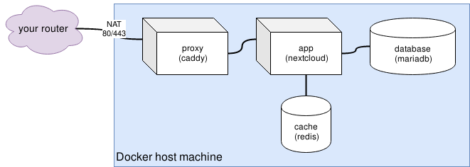

# A secure Nextcloud instance with Docker

## Introduction

Storing your private and sensitive data securely has become more important than
ever with the rise of internet cloud-service giants like Google, Apple, Dropbox
and similars.

There is no guaranteed way to ensure your data is kept untouched and only
controlled by yourself. Every major cloud service has had some kind of data
breach already.

This workshop's idea is to set up your own cloud-storage solution, with the
help of a software called Nextcloud. This software provides a very similar
experience to services such as Dropbox, providing access to your files via web,
Android/iOS app and a sync client, with one big difference: Nextcloud is run
on your own server. You are responsible for maintaining the server, therefore
you are in full control of your data.

## Why Docker?

Docker makes it way easier to update and maintain the software. This is key
for making server maintenance as little effort as possible.
A container image is a packaged application, with all its dependencies
as additional image layers. Updates are also automated thanks to the Docker
image registry / Docker Hub.

## Container topology
The service is assembled from several applications, not just Nextcloud:

1. A reverse proxy to handle incoming connections and TLS certficates
   via LetsEncrypt ([Caddy webserver](https://hub.docker.com/r/abiosoft/caddy/) 
   with a custom configuration)
2. The [Nextcloud](https://hub.docker.com/_/nextcloud/) application (which 
   consists of Apache2+PHP and Nextcloud itself)
3. A MySQL-compatible open source fork:
   [MariaDB](https://hub.docker.com/_/mariadb)
4. A caching service via [Redis](https://hub.docker.com/_/redis)
   Key-Value-Database

Each of them is encapsulated in its own container, following the core docker / 
containerization principles.
All services only communicate via their internal network ports, only the
reverse proxy is port-forwarded on the host machine via NAT.



## The services

### proxy

The reverse http proxy is handling two very important things:
1. Proxy incoming http/https connections to the application container in a more
   secure way than a direct connection to the Nextcloud instance
2. Automatically request/renew LetsEncrypt certificates for the configured
   domain

HTTPS is a fundamental requirement when running Nextcloud, as TLS encryption
encrypts each connection to the server.
Caddy was chosen for its simplicity and elegance in handling automatic
integration with the free [LetsEncrypt](https://letsencrypt.org/) service.
Caddy also takes away a lot of the encryption hassle, as it provides sane and
modern defaults (such as only enabling TLS1.2).

The supplied caddy configuration file implements the Nextcloud best practices,
such as adequate HSTS headers. You can find the configuration file at
`./config/proxy/Caddyfile`.

In this workshop, we use the image tagged "no-stats", which forbids caddy
to send telemetry data back to its vendor.

### app

This container houses the Nextcloud application itself. This means it runs
an Apache2 webserver plus a preconfigured PHP server.

### database

MySQL database containing all information your Nextcloud stores. It is
automatically initialized by Nextcloud.

### cache

Redis, a key-value in-memory database, is used for storing cache data for
quick access; it helps speeding up Nextcloud. There is nothing special in it's
etup, it just works out of the box. Additionally, persistence is enabled, 
which flushes the database to disk from time to time.

## Setup / Installation

1. Clone the git repository with <kbd>git clone</kbd>
2. Make sure both <kbd>docker</kbd> and <kbd>docker-compose</kbd> are
   installed.
3. In case you have mounted external disks for storage, you can change the
   bind volume paths in the `docker-compose.yml` file. All subdirectories will
   be created automatically with the appropriate permissions applied to them. If you do not want to change the host paths, you can also
   clone the project directly into a mounted disc, e.g. if your disk
   is mounted to `/mnt/bigdrive`, you could clone this project to
   `/mnt/bigdrive/nextcloud` and run it from there.
4. In order to use the caddy reverse proxy you have to change the configuration
   parameters in the `docker-compose.yml`. If you do not, the container will
   fail at startup. You can see **why** by running
   `docker-compose logs -f proxy` while the container tries to start.
5. Remember to set up port forwarding (80 and 443), as well as the appropriate
   DNS entries / DynDNS for your domain. This is needed to reach your Nextcloud
   instance from the internet, as well as requesting LetsEncrypt certificates.
6. If you are sure everything fits your needs, run
   ```sh
   docker-compose up -d
   ```
    or using the included `Makefile`:
    ```sh
    make
    ```
   and your Nextcloud should become available in a few seconds.

## Upgrading Nextcloud

Updating Nextcloud is as easy as typing two commands into your terminal:
```sh
docker-compose pull # pull the latest images of all defined services
docker-compose up -d # re-create containers that have a new image tag available
```

The officical Nextcloud container image is shipped without the web-updater, 
all upgrades should be done by upgrading the container image itself. When 
starting up the image with a newer Nextcloud version, a script detects the
change and automatically does the database migration.

## Using the `Makefile`

The included `Makefile` automates certain tasks such as running docker-compose,
updating, maintaining or resetting the nextcloud instance. You can use it by
running `make <target name>`.

The following targets are included:
- **run-daemon** (also default target): run docker-compose and put the services
  to the background (as daemon).
- **run-foreground**: run docker-compose and attach to a pseudo-terminal.
  Exiting will terminate all running services.
- **update**: pull any updated docker images and re-create containers with
  new image tags available.
- **stop**: stop the docker-compose service.
- **backup**: creates a backup of all data including the `git` history, and
  saves it to `./backups/<timestamp>.tar.gz`, excluding the `./backups`
  directory. The backup file is able to run the services anywhere in case of
  disaster recovery, as every needed component is included.
- **maintenance**: This runs certain database cleanup / improvement routines:
  - db:convert-filecache-bigint
  - db:convert-mysql-charset
  - db:add-missing-indices
- **clean**: WARNING: this make target first stops all services, and then
  **removes any persistent data and also all backups!**. This means all your
  data inside Nextcloud, and also all backups are gone afterwards. This target
  is only meant for quickly resetting a dummy instance to test out new
  features.
## Credits
Authors:
* Philipp Molitor <[https://phils-lab.io](https://phils-lab.io)>

This workshop resource was intended for use at the *Open Source / Linux days*
of the vocational school [ITech (BS14)](http://www.itech-bs14.de).

**You are free to use these resources for your own purposes, as long as you
give credits to the original authors.**